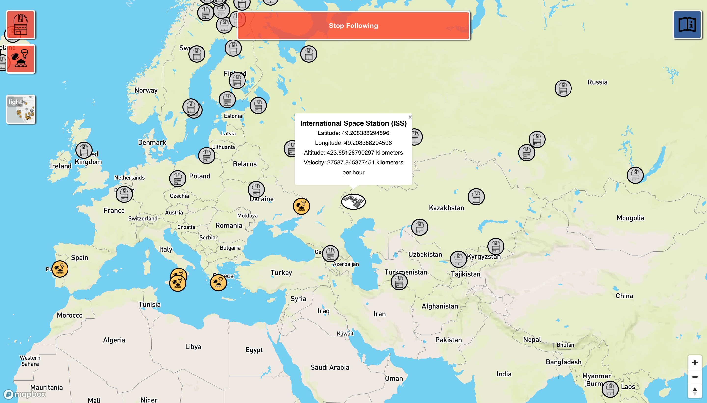

# International Space Station (ISS) Tracker
By babslabs

See the ISS in "real time"!

## About
The Babslabs ISS Tracker is an application built to track the location of the Internation Space Station across the world as it travels at speeds of over 7.660477 kilometers per second. The information for the ISS is updated every 3 seconds. Click on the ISS marker to display additional information about the ISS.

## Setup
- Clone the repo `git clone https://github.com/BabsLabs/iss_tracker.git`
- Change into project directory
- Install packages with `npm install`
- Start server with `npm start`

### Environment Variables
You need the following variables configured in your .env file

MAPBOX_ACCESS_TOKEN = "your_map_box_token

## Technologies

### Languages / Frameworks
- JavaScript ES6
- Node.js

### Libraries
- React
- MapboxGL
- Axios
- dotenv

### Extensions
- SCSS

### Buildpacks
- mars

## Requirements
- React 6.14.4 or compatiable versions
- Node.js